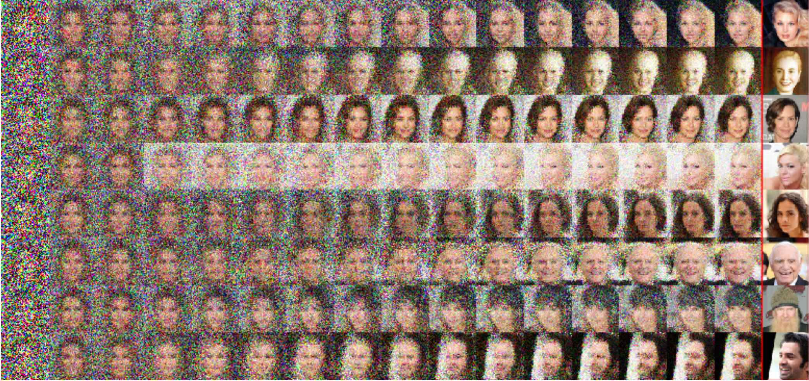

# Infusion Training

<p align="left">
  
</p>

This repository contains the code for the paper: <br />
**"Learning to Generate Samples from Noise through Infusion Training."**, <br />
Florian Bordes, Sina Honari, Pascal Vincent. <br />
https://arxiv.org/abs/1703.06975

In order to use it, you have to install Theano, Lasagne, Fuel and theirs dependencies. To run an
experiment on a GPU, you have to use:
```
THEANO_FLAGS=floatX=float32,device=cuda python run.py
```
